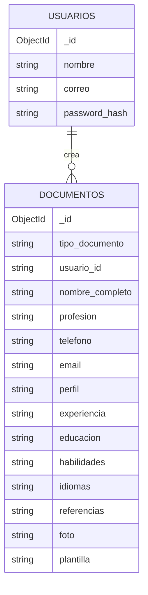
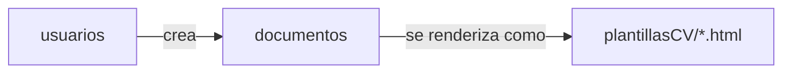

# Entidades de MongoDB

Este archivo resume las colecciones principales de la base de datos `proyecto_cv` y cómo se relacionan dentro de la aplicación.

## Colecciones

### `usuarios`

Guarda las cuentas que pueden autenticarse en la aplicación.

Campos principales:

- `_id`: identificador único generado por MongoDB.
- `nombre`: nombre visible del usuario.
- `correo`: correo de acceso, debe ser único en el registro.
- `password_hash`: contraseña almacenada como hash, no en texto plano.

### `documentos`

Guarda cada CV creado por un usuario autenticado.

Campos principales:

- `_id`: identificador único del documento.
- `tipo_documento`: tipo de documento guardado, por ahora `cv`.
- `usuario_id`: id del usuario propietario, tomado de la sesión.
- `nombre_completo`, `profesion`, `telefono`, `email` y `perfil`: datos de identidad y presentación.
- `experiencia`, `educacion`, `habilidades`, `idiomas` y `referencias`: contenido principal del CV.
- `foto`: ruta o valor asociado a la imagen del perfil.
- `plantilla`: nombre de la plantilla HTML usada para mostrar o exportar el CV.

## Relación

- Un usuario puede crear varios documentos.
- Cada documento pertenece a un solo usuario.
- La aplicación valida `usuario_id` en consultas de lectura, edición, eliminación y exportación para evitar acceso cruzado.

## Vista rápida

