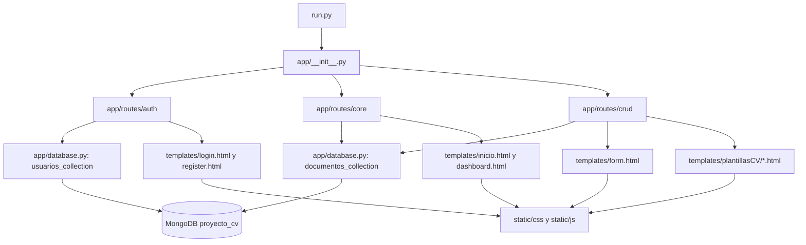

# Flujo de la aplicacion

Este diagrama muestra como se conectan los archivos y modulos principales de la app Flask.

## Lectura rapida

- `run.py` crea la app y lanza Flask.
- `app/__init__.py` registra los blueprints `auth`, `core` y `cv`.
- `app/database.py` centraliza la conexion a MongoDB y expone las colecciones `usuarios` y `documentos`.
- `app/routes/auth` maneja registro, login y cierre de sesion.
- `app/routes/core` maneja la pantalla inicial y el dashboard.
- `app/routes/crud` maneja crear, leer, actualizar, eliminar, ver en pantalla y descargar PDF del CV.
- `templates/` define la vista HTML y `static/` aporta estilos y JavaScript.

## Flujo general

1. El usuario entra por `run.py` -> `create_app()`.
2. Flask registra las rutas por blueprint.
3. Las rutas consultan o escriben en MongoDB a traves de `app/database.py`.
4. Los datos se renderizan con plantillas HTML y, si aplica, se exportan a PDF con WeasyPrint.
