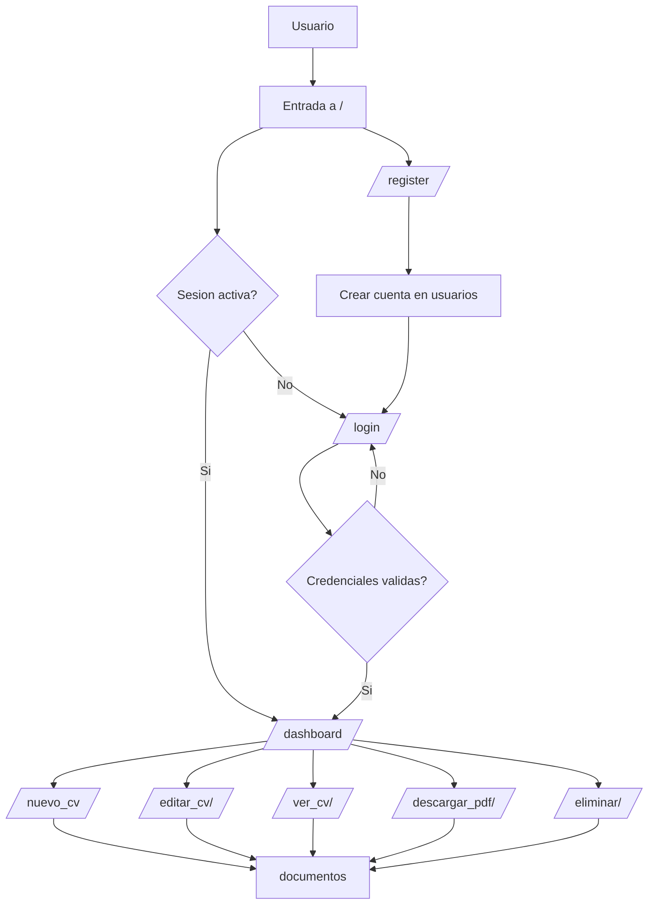
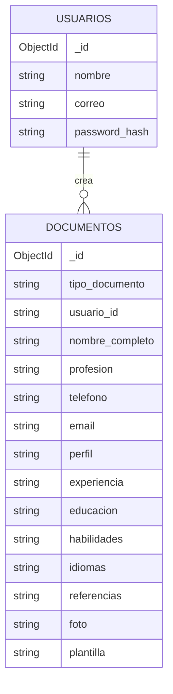

# Flujo de entidades CV

Este documento explica como se relacionan las entidades del sistema y como interactua el usuario con la aplicacion para crear, editar y gestionar su CV.

## Relacion entre entidades

- `usuarios` guarda la cuenta que inicia sesion.
- `documentos` guarda cada CV creado por un usuario.
- `documentos.usuario_id` apunta al `usuario_id` guardado en sesion y permite filtrar solo los CV del propietario.
- Un usuario puede tener varios documentos, pero cada documento pertenece a un solo usuario.

## Interaccion con la aplicacion

- El usuario entra a `/` y la aplicacion decide si mostrar `inicio.html` o enviar al `dashboard`.
- Desde el inicio puede ir a `register` para crear una cuenta o a `login` para entrar.
- Una vez autenticado, el `dashboard` muestra solo los CV que pertenecen al usuario autenticado.
- Desde el dashboard puede crear un CV nuevo, editar uno existente, previsualizarlo, descargarlo en PDF o eliminarlo.
- Cada accion sobre un CV consulta `documentos` y valida `usuario_id` para evitar que otro usuario vea o cambie documentos ajenos.

## Relacion con las rutas

- `register` inserta en `usuarios`.
- `login` busca en `usuarios` y valida `password_hash`.
- `nuevo_cv` inserta en `documentos` con `tipo_documento = cv`.
- `editar_cv`, `ver_cv`, `descargar_pdf` y `eliminar_cv` buscan por `_id` y `usuario_id` para evitar acceso cruzado.

## Campos clave del CV

- `nombre_completo`, `profesion`, `telefono`, `email` y `perfil` forman la identidad principal del CV.
- `experiencia`, `educacion`, `habilidades`, `idiomas` y `referencias` representan el contenido del documento.
- `plantilla` decide que archivo HTML de `templates/plantillasCV/` se usa para previsualizar o exportar el CV.
