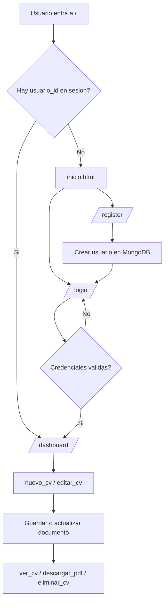

# Flujo del usuario

## Inicio

1. El usuario entra a `/`.
2. Si ya tiene sesion, se redirige a `/dashboard`.
3. Si no, ve la pagina de inicio y puede ir a login o registro.

## Registro y acceso

- En `register` se crea un usuario nuevo en MongoDB.
- En `login` se valida el correo y la contrasena con `check_password_hash`.
- Si el acceso es correcto, se guardan `usuario_id` y `nombre` en la sesion.

## Creacion y edicion de CV

- `nuevo_cv` abre el editor con un documento vacio.
- El formulario guarda datos como nombre, profesion, telefono, perfil, experiencia y plantilla.
- `editar_cv` carga un documento existente y actualiza el contenido con `update_one`.

## Vista, PDF y eliminacion

- `ver_cv` renderiza la plantilla elegida para previsualizar el CV.
- `descargar_pdf` usa WeasyPrint para generar el archivo PDF.
- `eliminar_cv` borra el documento solo si pertenece al usuario autenticado.

## Dashboard

- `dashboard` lista solo los documentos del usuario actual.
- Desde ahi se puede ver, descargar, editar o eliminar cada CV.
